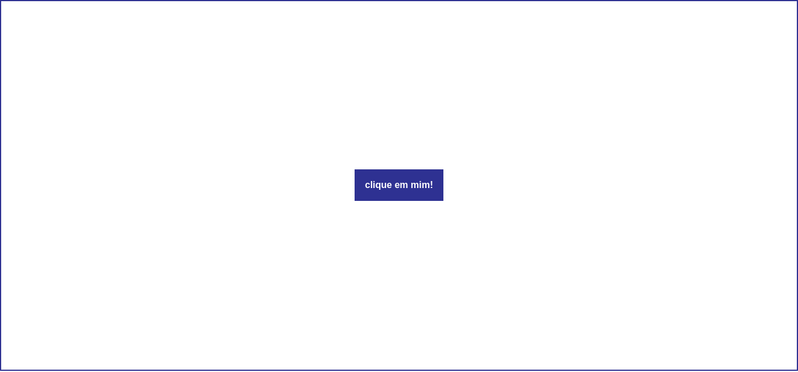
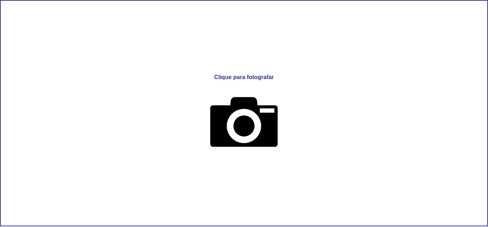

# Eventos e Métodos

Um evento é algo que acontece. Há muitas coisas acontecendo em nosso navegador, logo há muitos eventos também, um usuário pode clicar em botões, subir ou descer o scroll da página, pressionar botões do teclado, etc. 

Nós podemos manipular esses eventos que acontecem e criar funcionalidades interessantes em nossas interfaces conforme houver necessidade. Nossas interfaces devem oferecer interação com o usuário, uma forma de oferecer isso é criando a possibilidade de eventos acontecerem.

O vue oferece uma diretiva interessante chamada [v-on](https://br.vuejs.org/v2/guide/events.html#Escutando-Eventos), podemos usa-la para escutar os [eventos](https://pt.khanacademy.org/computing/computer-programming/html-css-js/html-js-dom-events/a/dom-event-types) do DOM em nossa página e adicionar alguma modificação quando eventos forem chamados. Exemplo:

Queremos escutar o evento Click do mouse em um botão, então adicionamos dentro da tag desse botão a diretiva v-on:click. 

```vue
<template>
  <div>
    <button v-on:click>{{frase}}</button>
  </div>
</template>

<script>
export default {
  name: 'Aula04',
  data () {
    return {
      frase: 'clique em mim!'
    }
  }
}
</script>
```


Já adicionamos nossa diretiva, mas não tinhamos feito nada com ela ainda. Agora vamos fazer isso! Vamos alterar o valor da nossa variável frase, quando o evento click for chamado vamos alterar esssa frase. 

Uma alternativa ao v-on é o @. É só um atalho para escrever menos letras.

```vue
<template>
  <div>
    <button @click="frase = 'Olá mundo'">{{frase}}</button>
  </div>
</template>

<script>
export default {
  name: 'Aula04',
  data () {
    return {
      frase: 'clique em mim!'
    }
  }
}
</script>
```


## Combinando eventos e métodos

Um método é uma forma de fazer algo, ou uma chamada para uma ação. Trazendo para o mundo real, o objeto lápis pode colorir, ou riscar, então dizemos que colorir e riscar são métodos do lápis. 

Na programação, poderíamos criar outros métodos, o lápis poderia ter o método apagar, ou o método cortar também, por menos legal que isso possa aparecer, podemos criar o que quisermos.

No próximo exemplo, queremos capturar o evento de click e disparar um método quando ele for chamado. Como já aprendemos, vamos usar a diretiva v-on, e para escutar o click v-on:click

```vue
<template>
  <div>
    <p>Clique para fotografar</p>
    
    
  </div>
</template>

<script>
export default {
  name: 'Aula04',
  data () {
    return {
      foto: ''
    }
  }
}
</script>
```


Temos duas imagens, a primeira é a câmera, onde adicionamos a nossa diretiva para capturar o click, e a segunda recebe uma variável foto que começa vazia. Quando o evento click for chamado, vamos chamar um método para adicionar uma imagem em nossa tag img adicionando o link de uma imagem dentro da variável vazia que criamos.

Abaixo de data, adicionamos methods, é onde podemos incluir os nossos métodos. Podemos entender um método como uma ação. Criamos agora nosso método, e chamamos ele de tiraFoto()

```vue
<template>
  <div>
    <p>Clique para fotografar</p>
    
    
  </div>
</template>

<script>
export default {
  name: 'Aula04',
  data () {
    return {
      foto: ''
    }
  },
  methods: {
    tiraFoto() {
      return this.foto = 'https://github.com/VaiNaWeb/progressive-web-apps/blob/master/aulas/aula04/assets/img05.jpg?raw=true'
    }
  }
}
</script>
```

