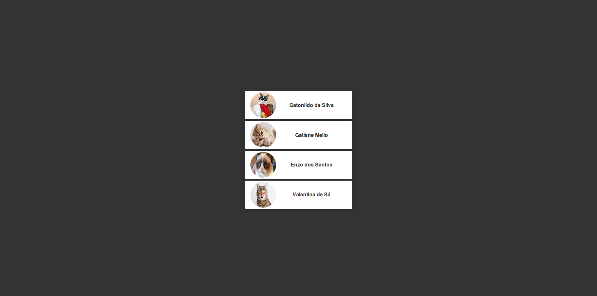

# Comunicação entre componentes

Já aprendemos interfaces em Vue podem ser compostas de vários componentes. Naturalmente, vamos precisar trocar informações entre esses componentes.

A forma mais simples como isso acontece se dá através da própria árvore de componentes, onde um filho recebe dados do seu componente pai. Vamos a um exemplo prático!

Navegando numa famosa rede social, podemos perceber que há um componente que se repete em mais de um lugar. Se você abrir a rede social você sabe qual, e em diversos outros sistemas, pode procurar, que você vai encontrar muitos componentes se repetindo em várias páginas ou simplesmente lugares diferentes dentro da mesma tela. Essa é uma das características ou vantagens de componentes, eles permitem o seu reuso.

Há um componente que queremos reusar, o componente gato. Esse componente contém duas propriedades, um nome e uma foto. Antes de tudo, em nosso componente gataria vamos adicionar apenas um gato para testar.


Componente gataria:
```html
<template>
  <div>
    <Gato />
  </div>
</template>
```
Componente gato:
```html
<template>
  <div>
    
    <span>Nome do gato</span>
   </div>
</template>
```


Algo importante que precisamos entender aqui, é que, como vamos adicionar esse componente mais de uma vez em nossa página, não seria interessante que as propriedades desse componente fossem passadas dentro dele. É uma boa ideia enviar essas propriedades através do componente pai. Dessa forma podemos colocar várias propriedades diferentes em cada vez que for preciso chama-lo.

Para enviar essas propriedades de gataria para gato, usamos Props. Basta definir quais propriedades mandar no componente pai com um atributo e um valor, assim:

Componente gataria:
```html
<template>
  <div>
    <Gato
      nome='Gatonildo da Silva'
      imagem='imagem.jpg'/>
  </div>
</template>
```

Depois, no componente filho chamamos essas props pelos seus atributos que criamos, assim:

Componente gato:
```html
<template>
  <div>
    
    <span>{{nome}}</span>
   </div>
</template>

<script>
  export default {
    name: 'Gato',
    props: ['imagem', 'nome']
  }
</script>
```


