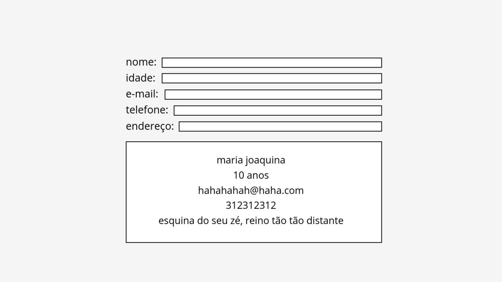

# Desafio01: Crie novos componentes em Vue
Explore o que você já aprendeu!

1. Crie dois novos componentes
2. Configure as páginas usando o Router

# Desafio02: Reagindo
Crie uma saudação de boas vindas no componente

1. Crie um novo componente
2. Crie uma label chamada nome
3. Crie um campo de input que receba esse dado
4. Exiba o dado que você recebeu
4. Solte sua criatividade e inclua novos elementos, estilos, e deixe essas boas vindas realmente acolheadora

# Desafio03: Crie novas reações!

1. Crie um componente para receber dados em um formulário
2. Exiba esses dados como no exemplo abaixo:

